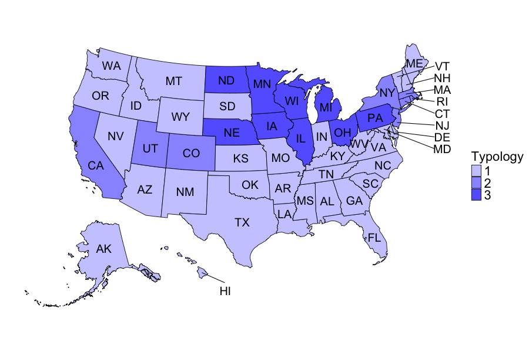
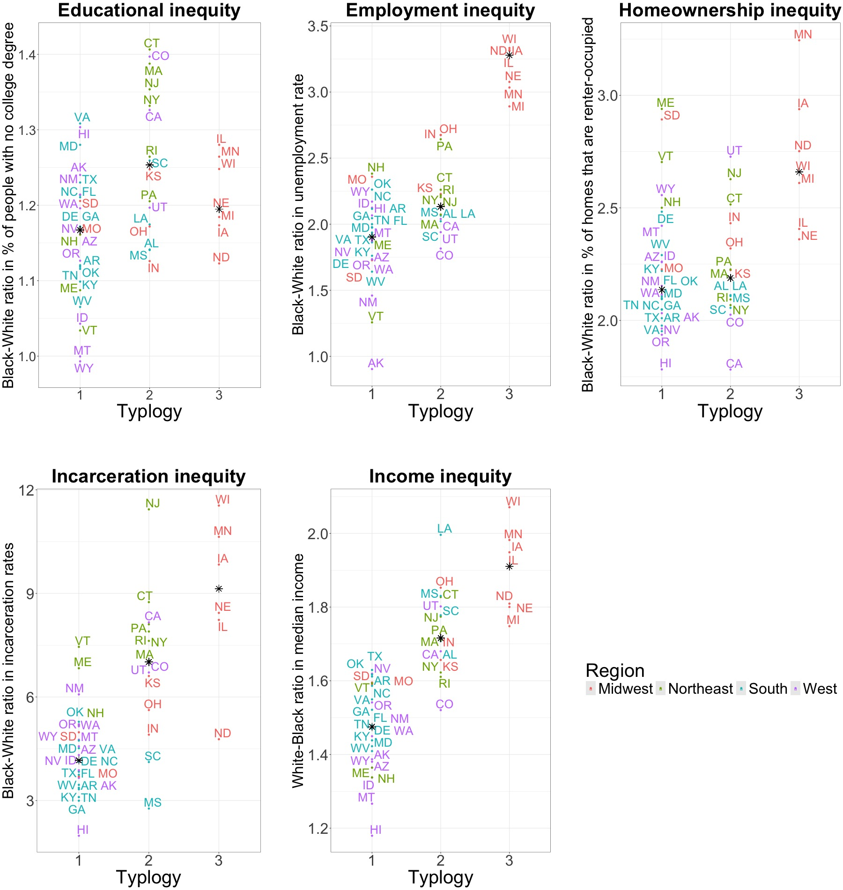
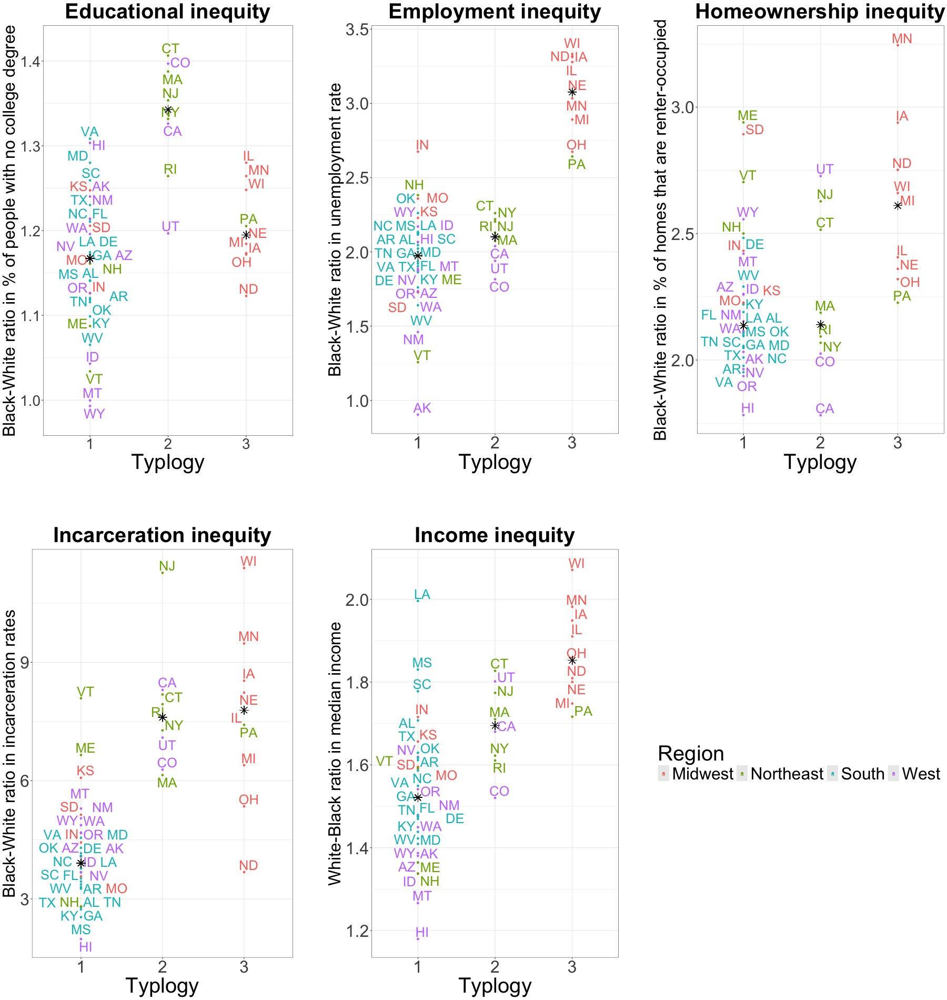

```{r setup, include=FALSE}
knitr::opts_chunk$set(echo = FALSE, warning = FALSE, message = FALSE)
```

## Import data

### Load libraries

```{r}
library(tidyverse)
library(statebins)
library(ggrepel)
library(cowplot)
library(knitr)
library(magrittr)
library(dplyr)
library(mapproj)
library(usmap)
```

### Import LPA results using alternative incarceration variable

```{r}
# Import LPA results
lpa_results <- read.csv("../../data/cleaned/lpa_all_classes_2019_alternative_no_dc.csv")

# Factor data
lpa_results$two_class<-as.factor(lpa_results$two_class)
lpa_results$three_class<-as.factor(lpa_results$three_class)
lpa_results$four_class<-as.factor(lpa_results$four_class)
lpa_results$five_class<-as.factor(lpa_results$five_class)

#Recode data to switch 1 and 2 for three_class for visualization purposes 
lpa_results_2 <- lpa_results %>% mutate(three_class_reordered = 
                                          case_when(three_class == 1 ~ 3,
                                                    three_class == 2 ~ 1,
                                                    three_class == 3 ~ 2))
#Factor data
lpa_results_2$three_class_reordered<-as.factor(lpa_results_2$three_class_reordered)

# Save as dataframe
lpa_results_2<-as.data.frame(lpa_results_2)

```

### Import structural racism domain data for alternative incarceration variable

```{r}
# Import structural racism domain data
structural_racism <- read.dta("../../data/cleaned/structural_racism_2019_alt_incarceration_var_no_dc.dta")

# Merge structural racism domain & LPA Result datasets
structural_racism_with_lpa <- merge(structural_racism, lpa_results_2, by.x = "state", by.y = "state")

# Export for comparison file 
write_csv(structural_racism_with_lpa, "../../data/cleaned/combined_results_2019_alternative_incarc_no_dc.csv")
```


### Load data

```{r}
original_2019 <- read_csv("../../data/cleaned/combined_results_2019_original_incarc_no_dc.csv")
alternative_2019 <- read_csv("../../data/cleaned/combined_results_2019_alternative_incarc_no_dc.csv")

original_2019 %<>% mutate(domains = "original")
alternative_2019 %<>% mutate(domains = "alternative")

all <- rbind(original_2019, alternative_2019) %>% arrange(state, year, domains)
all <- all[,c(1,13,2:12)]
```

### Add abbreviations

```{r}
# Download file on US Census Regions & Divisions from https://github.com/cphalpert/census-regions/blob/master/us%20census%20bureau%20regions%20and%20divisions.csv

# Import data on US Census Bureau region & division
us_census<- read_csv("../../data/raw/us-census/us_census_bureau_regions_and_divisions.csv")

# Remove DC
us_census<- us_census %>% filter(State !="District of Columbia")

# Merge with existing dataset
all_2 <- merge(all, us_census, by.x = "state", by.y = "State")
```

### Recode class numbers for visualization purposes

```{r}
# Remove previous column of recoded variable 
all_2 %<>% select(-three_class_reordered)

all_recoded <- all_2 %>% mutate(three_class_recoded = 
                                case_when(domains == "original" & year == 2019 & three_class == 2 ~ 1,
                                          domains == "original" & year == 2019 & three_class == 1 ~ 2,
                                          domains == "original" & year == 2019 & three_class == 3 ~ 3, 
                                          domains == "alternative" & year == 2019 & three_class == 2 ~ 3, 
                                          domains == "alternative" & year == 2019 & three_class == 1 ~ 1, 
                                          domains == "alternative" & year == 2019 & three_class == 3 ~ 2, 
                                          TRUE ~ NA
                                          ))

all_recoded %<>% rename(State.Code = "State Code")

original_2019_2 <- all_recoded %>% filter(domains == "original") %>% filter(year == 2019)
original_2019_2$three_class_recoded <- as.factor(original_2019_2$three_class_recoded)

# exploratory
original_2019_3 <- original_2019_2 %>% select(state, three_class_recoded) %>% filter(three_class_recoded == 3)


alternative_2019_2 <- all_recoded %>% filter(domains == "alternative")
alternative_2019_2$three_class_recoded <- as.factor(alternative_2019_2$three_class_recoded)

alternative_2019_3 <- alternative_2019_2 %>% select(state, three_class_recoded) %>% filter(three_class_recoded == 3)
```

## Maps of 3-class models

### Original model (ie, NCRP incarceration variable with missing data for AL, MI and LA)

```{r}
# Add additional data needed for mapping
# Generate centroid_labels dataset
centroid_labels <- usmapdata::centroid_labels(regions = "states")

# Extract x and y coordinates from the geom column
centroid_labels <- centroid_labels %>%
  mutate(
    x = as.numeric(str_extract(geom, "-?\\d+\\.?\\d*")),  # Extract first number (x)
    y = as.numeric(str_extract(geom, "(?<= )[\\-0-9.]+")) # Extract second number (y)
  )

# Subset into 2 datasets
centroid_labels_most <- centroid_labels[!(centroid_labels$abbr %in% 
                                            c("VT", "NH", "MA", "RI", "CT", 
                                              "NJ", "DE", "MD", "HI")),]

centroid_labels_east <- centroid_labels[(centroid_labels$abbr %in% 
                                            c("VT", "NH", "MA", "RI", "CT", 
                                              "NJ", "DE", "MD")),]

centroid_labels_hi <- centroid_labels[(centroid_labels$abbr == "HI"),]

# Combine centroid_labels_most with lpa_results_r
most_states <- merge(original_2019_2, centroid_labels_most, by.x = "state", by.y = "full")

# Combine centroid_labels_east with lpa_results_r and reorder
east_states <- merge(original_2019_2, centroid_labels_east, by.x = "state", by.y = "full")
east_states_ordered <- east_states[c(8,5,4,7,1,6,2,3),]

# Combine centroid_labels_hi with lpa_results_r
hi_state <- merge(original_2019_2, centroid_labels_hi, by.x = "state", by.y = "full")
```

```{r}
viz2 <-  plot_usmap(regions = "states", 
             labels = FALSE, 
             data = original_2019_2,
             values = "three_class_recoded") +
  scale_fill_manual(values = c("1"= "#CCCCFF", "2" = "#9999FF", "3" = "#6666FF"), 
                    name = "Typology", na.translate = F) + 
  theme(legend.position = "right", legend.text = element_text(size=22), legend.title = element_text(size=22)) + 
  geom_text(data = most_states, 
            ggplot2::aes(x = x, y = y, 
                         label = abbr), color = "black") + 
  geom_segment(data = east_states_ordered, 
            ggplot2::aes(x = x, xend = 2600000, y = y, yend = (-3:4)*(-150000), 
                         label = abbr), color = "black") + 
  geom_text(data = east_states_ordered, 
            ggplot2::aes(x=2700000, y=(-3:4)*(-150000), label = abbr), color = "black") +
  geom_segment(data = hi_state, 
            ggplot2::aes(x = x, xend = (-60000), y = y, yend = (-2300000), 
                         label = abbr), color = "black") +  
  geom_text(data = hi_state, 
            ggplot2::aes(x=(-50000), y=(-2400000), label = abbr), color = "black")

jpeg(filename= "../../data/viz/viz_map_3_class_2019_original_incarc_var_sens.jpeg", width= 900, height= 600, quality= 100)
print(viz2)
```

```{r, echo = TRUE}
# Map of 3-classes
include_graphics("../../data/viz/viz_map_3_class_2019_original_incarc_var_sens.jpeg")
```

### Alternative model (NPS with no missing data)

```{r}
## Add additional data needed for mapping
# Subset into 2 datasets
centroid_labels_most <- centroid_labels[!(centroid_labels$abbr %in% 
                                            c("VT", "NH", "MA", "RI", "CT", 
                                              "NJ", "DE", "MD", "HI")),]

centroid_labels_east <- centroid_labels[(centroid_labels$abbr %in% 
                                            c("VT", "NH", "MA", "RI", "CT", 
                                              "NJ", "DE", "MD")),]

centroid_labels_hi <- centroid_labels[(centroid_labels$abbr == "HI"),]

# Combine centroid_labels_most with lpa_results_r
most_states <- merge(alternative_2019_2, centroid_labels_most, by.x = "state", by.y = "full")

# Combine centroid_labels_east with lpa_results_r and reorder
east_states <- merge(alternative_2019_2, centroid_labels_east, by.x = "state", by.y = "full")
east_states_ordered <- east_states[c(8,5,4,7,1,6,2,3),]

# Combine centroid_labels_hi with lpa_results_r
hi_state <- merge(alternative_2019_2, centroid_labels_hi, by.x = "state", by.y = "full")
```


```{r}
viz3 <-  plot_usmap(regions = "states", 
             labels = FALSE, 
             data = alternative_2019_2,
             values = "three_class_recoded") +
  scale_fill_manual(values = c("1"= "#CCCCFF", "2" = "#9999FF", "3" = "#6666FF"), 
                    name = "Typology", na.translate = F) + 
  theme(legend.position = "right", legend.text = element_text(size=22), legend.title = element_text(size=22)) + 
  geom_text(data = most_states, 
            ggplot2::aes(x = x, y = y, 
                         label = abbr), color = "black") + 
  geom_segment(data = east_states_ordered, 
            ggplot2::aes(x = x, xend = 2600000, y = y, yend = (-3:4)*(-150000), 
                         label = abbr), color = "black") + 
  geom_text(data = east_states_ordered, 
            ggplot2::aes(x=2700000, y=(-3:4)*(-150000), label = abbr), color = "black") +
  geom_segment(data = hi_state, 
            ggplot2::aes(x = x, xend = (-60000), y = y, yend = (-2300000), 
                         label = abbr), color = "black") +  
  geom_text(data = hi_state, 
            ggplot2::aes(x=(-50000), y=(-2400000), label = abbr), color = "black")

jpeg(filename= "../../data/viz/viz_map_3_class_2019_alternative_incarc_var_sens.jpeg", width= 900, height= 600, quality= 100)
print(viz3)
```

```{r, echo = TRUE}

```

```{r}
# Pulling out states that changed classes
compare_2019 <- all_recoded %>% filter(year == 2019) %>% select(state, State.Code, domains, three_class_recoded)

compare_2019_wide <- compare_2019 %>% pivot_wider(names_from = domains, values_from = three_class_recoded)

compare_2019_wide %<>% mutate(is_different = if_else(original == alternative, 0, 1))

summary <- compare_2019_wide %>% group_by(is_different, state) %>% summarize()

summary2 <- as.tibble(compare_2019_wide %>% filter(is_different == 1) %>% select(state, original, alternative))

summary2 %<>% rename(
  orignal_or_NRCP = original,
  alternative_or_NPS = alternative
)
```

```{r,echo = TRUE}
# Table of specific states that changed 
kable(summary2, caption = "States that changed classes when using NCRP vs NPS data")
```

## Cluster plots

$~$

### Cluster plot of original (NCRP) incarceration data

```{r}
# Create new dataset with median values for each variable for each class

# Copy dataset
med_data <- all_recoded %>% filter(year == 2019) %>% select(-c(two_class, three_class, four_class, five_class))

# Create dataset for original analysis 
med_data2 <- med_data %>% filter(domains == "original")

# Subset by class
class1<- med_data2 %>% filter(three_class_recoded == 1)
class2<- med_data2 %>% filter(three_class_recoded == 2)
class3<- med_data2 %>% filter(three_class_recoded == 3)

class1<- class1 %>% mutate(
  education_median = median(no_college_RR, na.rm= TRUE), 
  unemployment_median = median(unemployment_RR, na.rm= TRUE), 
  income_median = median(median_income_ratio, na.rm = TRUE), 
  renters_median = median(renters_RR, na.rm = TRUE), 
  incarceration_median = median(incarceration_RR, na.rm= TRUE)
)

class2<- class2 %>% mutate(
  education_median = median(no_college_RR, na.rm= TRUE), 
  unemployment_median = median(unemployment_RR, na.rm= TRUE), 
  income_median = median(median_income_ratio, na.rm = TRUE), 
  renters_median = median(renters_RR, na.rm = TRUE), 
  incarceration_median = median(incarceration_RR, na.rm= TRUE)
)

class3<- class3 %>% mutate(
  education_median = median(no_college_RR, na.rm= TRUE), 
  unemployment_median = median(unemployment_RR, na.rm= TRUE), 
  income_median = median(median_income_ratio, na.rm = TRUE), 
  renters_median = median(renters_RR, na.rm = TRUE), 
  incarceration_median = median(incarceration_RR, na.rm= TRUE)
)

# Combine datasets
all_classes<- rbind(class1, class2, class3)
all_classes$three_class_recoded <- as.factor(all_classes$three_class_recoded)
```

```{r}
# Create legend function
legend_function <- function(all_classes, class_prediction){
  legendplot<- ggplot(all_classes, aes(class_prediction, no_college_RR,label=State.Code, color=Region)) +
  geom_point() +
  geom_text_repel(max.overlaps = 100, nudge_x=.05) +
  xlab("Typlogy") +
  ylab("Black-White ratio in % with no college degree") +
  ggtitle("Education inequity") + 
  theme(legend.position = "bottom", text= element_text(size=40),
        legend.key.size = 1.5, "cm") + 
    guides(color = guide_legend(override.aes= list(size=30)))
}
```

```{r}
# Create education function
education_function <- function(all_classes, class_prediction){
  p2 <- ggplot(all_classes, aes(class_prediction, no_college_RR,label=State.Code, color=Region)) +
  ylim(.98,1.42) +
  geom_point() +
  geom_text_repel(label=all_classes$State.Code, size=9, max.overlaps=20, nudge_x=.005, nudge_y=.005, segment.color= "transparent") +
  xlab("Typlogy") +
  ylab("Black-White ratio in % of people with no college degree") +
  ggtitle("Educational inequity") + 
  geom_point(data= all_classes, aes(x=class_prediction, y=education_median), col= "black", pch = 8, size = 5) +
  theme_bw() +
  theme(plot.title = element_text(face= "bold", hjust = .5, size=40), legend.position = "none", text= element_text(size=35),
        axis.title.y = (text=element_text(size=32)), axis.title.x=(text=element_text(size=40)))
}
```

```{r}
# Create unemployment function
unemployment_function <- function(all_classes, class_prediction){
  p3 <- ggplot(all_classes, aes(class_prediction, unemployment_RR,label=State.Code, color=Region, show.legend = FALSE)) +
  ylim(.90,3.4) +
  geom_point() +
  geom_text_repel(label=all_classes$State.Code, size=9, max.overlaps=20, nudge_x=.005, nudge_y=.005, segment.color= "transparent") +
  xlab("Typlogy") +
  ylab("Black-White ratio in unemployment rate") +
  ggtitle("Employment inequity") + 
  geom_point(data= all_classes, aes(x=class_prediction, y=unemployment_median), col= "black", pch = 8, size = 5) +
  theme_bw() + 
  theme(plot.title = element_text(face= "bold", hjust = .5, size=40), legend.position = "none", text= element_text(size=40),
        axis.title.y = (text=element_text(size=32)), axis.title.x=(text=element_text(size=40)))
}
```

```{r}
# Create income function
income_function <- function(all_classes, class_prediction){
  p4 <- ggplot(all_classes, aes(class_prediction, median_income_ratio,label=State.Code, color=Region, show.legend = FALSE)) +
  geom_point() +
  geom_text_repel(label=all_classes$State.Code, size=9, max.overlaps=20, nudge_x=.005, nudge_y=.005, segment.color= "transparent") +
  xlab("Typlogy") +
  ylab("White-Black ratio in median income") +
  ggtitle("Income inequity") + 
  geom_point(data= all_classes, aes(x=class_prediction, y=income_median), col= "black", pch = 8, size = 5) +
  theme_bw() +
  theme(plot.title = element_text(face= "bold", hjust = .5, size=40), legend.position = "none", text= element_text(size=40),
        axis.title.y = (text=element_text(size=32)), axis.title.x=(text=element_text(size=40)))
}
```

```{r} 
# Create homeownership function
homeownership_function <- function(all_classes, class_prediction){
p5 <- ggplot(all_classes, aes(class_prediction, renters_RR,label=State.Code, color=Region, show.legend = FALSE)) +
  geom_point() +
  geom_text_repel(label=all_classes$State.Code, size=9, max.overlaps=20, nudge_x=.005, nudge_y=.005, segment.color= "transparent") +
  xlab("Typlogy") +
  ylab("Black-White ratio in % of homes that are renter-occupied") + 
  ggtitle("Homeownership inequity") +
  geom_point(data= all_classes, aes(x=class_prediction, y=renters_median), col= "black", pch = 8, size = 5) +
  theme_bw() +
    theme(plot.title = element_text(face= "bold", hjust = .5, size=40), legend.position = "none", text= element_text(size=40), axis.title.y = (text=element_text(size=32)), axis.title.x=(text=element_text(size=40)))
}
```

```{r}
# Create incarceration function
incarceration_function <- function(all_classes, class_prediction){
p6 <- ggplot(all_classes, aes(class_prediction, incarceration_RR,label=State.Code, color=Region, show.legend = FALSE)) +
  geom_point() +
  geom_text_repel(label=all_classes$State.Code, size=9, max.overlaps=20, nudge_x=.005, nudge_y=.005, segment.color= "transparent") +
  xlab("Typlogy") +
  ylab("Black-White ratio in incarceration rates") + 
  ggtitle("Incarceration inequity") + 
  geom_point(data= all_classes, aes(x=class_prediction, y=incarceration_median), col= "black", pch = 8, size= 5) +
  theme_bw() + 
  theme(plot.title = element_text(face= "bold", hjust = .5, size=40), legend.position = "none", text= element_text(size=40),
        axis.title.y = (text=element_text(size=32)), axis.title.x=(text=element_text(size=40)))
}
```

```{r}
# Call functions
legendplot <- legend_function(all_classes, all_classes$three_class_recoded)
p2 <- education_function(all_classes, all_classes$three_class_recoded)
p3 <- unemployment_function(all_classes, all_classes$three_class_recoded)
p4 <- income_function(all_classes, all_classes$three_class_recoded)
p5 <- homeownership_function(all_classes, all_classes$three_class_recoded)
p6 <- incarceration_function(all_classes, all_classes$three_class_recoded)
```

```{r}
# Create vertical plot (paper-style)
legend_1<- get_legend(legendplot +
                     guides(color=guide_legend(nrow=1)) +
                     theme(legend.position="right", legend.key.size= unit(.75, "cm") ))

prow<- plot_grid(p2, NA, p3, NA, p5, NA, NA, NA, NA, NA, p6, NA, p4, NA, legend_1, nrow=3, rel_widths=c(1, .1, 1, .1, 1, .1, .1, .1, .1, .1, 1, .1, 1, .1, 1), rel_heights= c(1, .1, 1))
  
paper<- plot_grid(prow, ncol=1)

jpeg(filename= "../../data/viz/viz_cluster_plot_3_class_orig_incarc_var_sens.jpeg", width= 1800, height= 1900, quality= 100)
print(paper)
```

```{r, echo = TRUE}
# Display vertical plot

```

$~$

### Cluster plot with alternative (NPS) incarceration data

```{r}
#Create new dataset with median values for each variable for each class

# Copy dataset
med_data3 <- med_data %>% filter(domains == "alternative")

# Subset by class
class1<- med_data3 %>% filter(three_class_recoded == 1)
class2<- med_data3 %>% filter(three_class_recoded == 2)
class3<- med_data3 %>% filter(three_class_recoded == 3)

class1<- class1 %>% mutate(
  education_median = median(no_college_RR, na.rm= TRUE), 
  unemployment_median = median(unemployment_RR, na.rm= TRUE), 
  income_median = median(median_income_ratio, na.rm = TRUE), 
  renters_median = median(renters_RR, na.rm = TRUE), 
  incarceration_median = median(incarceration_RR, na.rm= TRUE)
)

class2<- class2 %>% mutate(
  education_median = median(no_college_RR, na.rm= TRUE), 
  unemployment_median = median(unemployment_RR, na.rm= TRUE), 
  income_median = median(median_income_ratio, na.rm = TRUE), 
  renters_median = median(renters_RR, na.rm = TRUE), 
  incarceration_median = median(incarceration_RR, na.rm= TRUE)
)

class3<- class3 %>% mutate(
  education_median = median(no_college_RR, na.rm= TRUE), 
  unemployment_median = median(unemployment_RR, na.rm= TRUE), 
  income_median = median(median_income_ratio, na.rm = TRUE), 
  renters_median = median(renters_RR, na.rm = TRUE), 
  incarceration_median = median(incarceration_RR, na.rm= TRUE)
)

# Combine datasets
all_classes<- rbind(class1, class2, class3)
all_classes$three_class_recoded <- as.factor(all_classes$three_class_recoded)
```

```{r}
# Call functions
legendplot <- legend_function(all_classes, all_classes$three_class_recoded)
p2 <- education_function(all_classes, all_classes$three_class_recoded)
p3 <- unemployment_function(all_classes, all_classes$three_class_recoded)
p4 <- income_function(all_classes, all_classes$three_class_recoded)
p5 <- homeownership_function(all_classes, all_classes$three_class_recoded)
p6 <- incarceration_function(all_classes, all_classes$three_class_recoded)
```

```{r}
# Create vertical plot (paper-style)
legend_1<- get_legend(legendplot +
                     guides(color=guide_legend(nrow=1)) +
                     theme(legend.position="right", legend.key.size= unit(.75, "cm") ))

prow<- plot_grid(p2, NA, p3, NA, p5, NA, NA, NA, NA, NA, p6, NA, p4, NA, legend_1, nrow=3, rel_widths=c(1, .1, 1, .1, 1, .1, .1, .1, .1, .1, 1, .1, 1, .1, 1), rel_heights= c(1, .1, 1))
  
paper<- plot_grid(prow, ncol=1)

jpeg(filename= "../../data/viz/viz_cluster_plot_3_class_alt_incarc_var_sens.jpeg", width= 1800, height= 1900, quality= 100)
print(paper)
```

```{r, echo = TRUE}
# Display vertical plot

```
